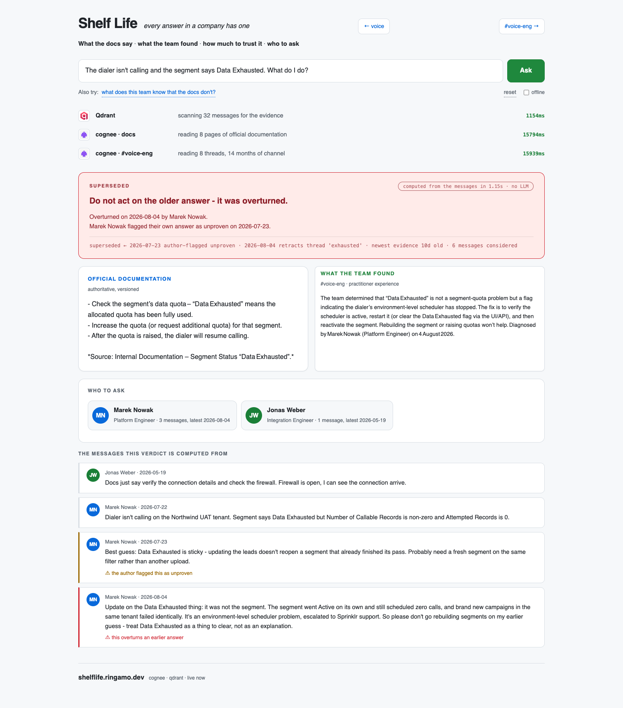
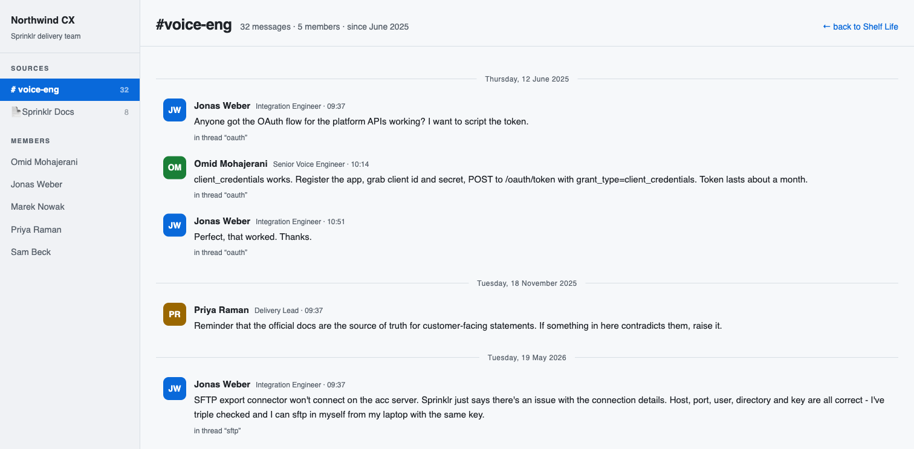

# Shelf Life

**Every answer in a company has one.**

Built for *Give Your Slack a Memory* — the Cognee × Qdrant Hack Night, Berlin, 2026-08-14.

| | |
|---|---|
| **Live — talk to it** | https://shelflife.ringamo.dev |
| **Live — type to it** | https://shelflife.ringamo.dev/text |
| **The channel it reads** | https://shelflife.ringamo.dev/chat |


*Ask it out loud. While it answers, the room watches Qdrant land in ~120ms and
both cognee legs take ~20s — then the verdict, who to ask, and both sources.*

---

## The problem

Your team's real knowledge is not in the docs. It's in a channel, in a thread, three
replies down, written eighteen months ago by someone who has since left.

So you search. And you find *something*. And you have no idea whether it is still true.

That's not a retrieval problem — retrieval works fine. It's a **trust** problem:

- The official docs are **confidently wrong** about this specific case.
- The real answer was pieced together across five messages: a symptom, a wrong guess,
  a diagnosis, a fix, and a better fix.
- Someone answered this in 2025 and someone else **overturned it** in 2026.
- The person who wrote the answer **said themselves they weren't sure** — and was later
  proved wrong.

A vector search returns all of that, ranked by similarity, with no way to tell which is which.

## What Shelf Life does

Every answer comes back with four things instead of one:

| | |
|---|---|
| **What the docs say** | Authoritative, versioned, dated — and sometimes wrong |
| **What the team found** | The conclusion of the thread, not the first reply |
| **How much to trust it** | `current` · `stale` · `unproven` · `superseded` |
| **Who to ask** | The person who actually worked it out, and when |

### The trust verdict is computed, not guessed

Three things can undermine an answer, and they are **not** the same thing:

- **superseded** — someone explicitly overturned it later
- **unproven** — the author hedged, on the record
- **stale** — nobody has touched it in months

Asking a model "is this trustworthy?" produces a vibe. Shelf Life reads the metadata off
the actual messages behind the answer, so the verdict is deterministic and you can point at
the message that caused it.

## Why both Cognee and Qdrant

Each does something the other can't:

- **Cognee** reads a whole *thread* and distils the answer. The real answer to
  "why won't my SFTP connector authenticate" does not exist in any single message — it's
  spread across a symptom, a wrong guess, a diagnosis and two fixes. Cognee is also asked
  the docs and the channel **separately**, so their disagreement is visible instead of
  blended away.
- **Qdrant** finds *which messages* back that answer, with `date`, `author`, `unproven`
  and `supersedes` in the payload. That's the evidence the verdict is computed from.

Cognee gives the answer. Qdrant gives you what you need to judge it.

## The four demo questions

Real cases, from real hard-won knowledge about a real product:

| Question | Docs | Channel | Verdict |
|---|---|---|---|
| SFTP connector won't connect, credentials are correct | **Confidently wrong** — blames a feature flag and permissions | It's SHA-1: the connector signs RSA keys with legacy `ssh-rsa`, which OpenSSH 8.8+ rejects | `current` |
| How do I push callback completion status out? | **Silent** — there is no such endpoint | Post Call Workflow → External REST API connector, plus six gotchas | `current` |
| How do I authenticate to the platform API? | Silent | 2025 said `client_credentials`; **overturned 2026-07-02** — now auth-code flow | **`superseded`** |
| Dialer isn't calling, segment says Data Exhausted | Silent | First answer **flagged unproven by its own author**, then contradicted — it was an environment-level scheduler bug | **`superseded` + `unproven`** |

The last one is the point of the whole project. A similarity search hands you a colleague's
guess as though it were fact. Shelf Life says *"treat as a guess — the author said so
themselves"* and shows you the message where he retracted it.

## Screenshots

**The text version** — same memory, typed. `#voice-eng` and the official docs answered
separately, so their disagreement stays visible.



**The channel** — fourteen months of it, with the hedges and retractions marked. Post here
and the memory revises what it knows.



## Run it

```bash
python3 -m venv .venv && ./.venv/bin/pip install -r requirements.txt
export COGNEE_CLOUD_URL=... COGNEE_CLOUD_API_KEY=... QDRANT_URL=http://127.0.0.1:6333

python3 tools/build_shelflife_corpus.py corpus    # docs + channel
python3 tools/ingest_shelflife.py corpus          # two cognee datasets + qdrant
cd app && uvicorn main:app --host 0.0.0.0 --port 8000
```

## The corpus

Two sources, deliberately in conflict.

**`docs/`** — official product documentation, carrying its real version number and last-updated
date. Ingested from a local Confluence export when present; the repo ships **paraphrased
stubs**, because vendor documentation is not ours to redistribute.

**`channel/`** — a 32-message engineering channel across 14 months, with 7 threads, **2 answers
flagged unproven by their own authors, and 2 supersessions**. Written from real incidents:
the SHA-1 SFTP failure, the missing callback-status API, the VoiceConnect ACL that doesn't
resolve hostnames.

Synthetic, so it can be published — but every gotcha in it cost somebody a real day.

## It's Slack-shaped, not Slack-only

The channel format is a thin adapter. The problem this solves is worst in exactly the places
that aren't Slack: Microsoft Teams channels nobody reads, where the same question gets asked
a year apart and answered from scratch every time. Swapping the ingest adapter is the only
change needed.
